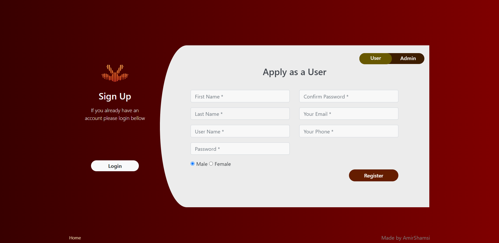
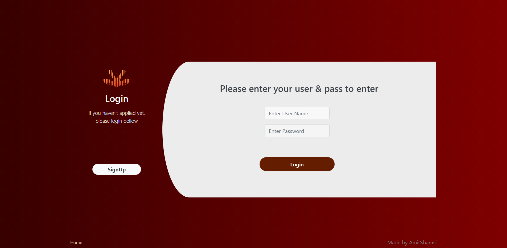

#  Simple Php Website

This is a personal website which's coded by raw php and translated to Persian :)

<p align='center'>
  <a href="https://en.wikipedia.org/wiki/PHP">
    
  </a> 
</p>

### The Website Has These Options

* Show New Articles
* Upload Articles (Admins-ONLY)
* Search in Articles
* Sign-Up (User & Admin separated) 
* Log-in
* etc.

## Lets See Some Screen Shots

<p align='center'>
  <h6 align="center">ScreenShot 1</h6>
  
  <h6 align="center">ScreenShot 2</h6>
  
  <h6 align="center">ScreenShot 3</h6>
  
  <h6 align="center">ScreenShot 4</h6>
  
</p>

## Installation

1. Clone the repo
   ```sh
   git clone https://github.com/Amir-Shamsi/simple-php-blog.git
   ```

## License

This project is licensed under the MIT License - see the [LICENSE](LICENSE) file for details
